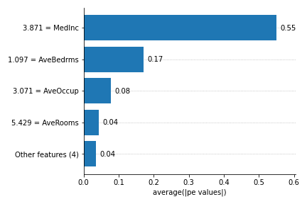

==========
Installing
==========

There is two types of releases that you can install: official releases and
under-development-but-latest releases.

The documentation is always up to date to the latest releases, but this 
releases are only pushed to PyPi when enough testing, profilling and 
code coverage increase is done.

Official releases 
-----------------

All official releases are uploaded in PyPi. To install via pip, simply run:

.. code-block:: console

    python -m pip install itea

Latest releases
---------------

The latest releases are always committed to GitHub before more intensively
tested to be released on PyPi. To install, just download the GitHub repository
(`itea-python GitHub page <https://github.com/gAldeia/itea-python>`_)
and run (on the root):

.. code-block:: console

    python -m pip install .

================
Minimal examples
================

Before jumping into using the library, here are some tips and examples that
might make it easier to use.

ITEA can be used for regression (with the ``ITEA_regressor`` class) or for
classification (``ITEA_classifier``). Both classes inherit from base classes
in the scikit-learn library, and implement very similar methods. The simplest
use is to create an instance and use the fit method.

Fitting an estimator
--------------------

.. code-block:: python

    from sklearn import datasets

    # Loading regression data and fitting an ITEA regressor
    from itea.regression import ITEA_regressor

    housing_data = datasets.fetch_california_housing()
    X_reg, y_reg = housing_data['data'], housing_data['target']
    labels       = housing_data['feature_names']

    reg = ITEA_regressor(labels=labels).fit(X_reg, y_reg)

    # loading classification data and fitting an ITEA classifier
    from itea.classification import ITEA_classifier

    iris_data      = datasets.load_iris()
    X_clf, targets = iris_data['data'], iris_data['target']

    clf = ITEA_classifier().fit(X_clf, targets)

The convention is to always pass arguments by name for all that are not
mandatory and have default values ​​defined. To specify a setting other than
the default, we must pass the arguments by name:

.. code-block:: python

    reg = ITEA_regressor(gens=50, popsize=200).fit(X_reg, y_reg)

    # the line below does not work
    reg = ITEA_regressor(50, 200).fit(X_reg, y_reg)

The documentation presents the default values ​​for each algorithm, with
exaplanations of what they represent.

Using the final Symbolic Expression to make predictions
-------------------------------------------------------

After performing the evolution (fitting the ``ITEA``), the best symbolic
expression can be accessed by the ``bestsol_`` attribute. The best expression
is an already fitted sckit estimator. The ``bestsol_`` is used to predict,
calculate the score, print the expression, and to obtain interpretability
with model-agnostic (or the model-specific ``ITExpr_explainer``) explainers.

The ``ITEA`` instance implements the predict method, but essentially it just
uses bestsol's predict.

.. code-block:: python

    final_itexpr = reg.bestsol_

    # Returns the predictions for every observation
    final_itexpr.predict(X_reg)

    # yields the same result as the previous line
    reg.predict(X_reg)

    # Will print the expression as string. 
    print(final_itexpr)

The last line will print the expression:

.. code-block:: console

    9.924*log(MedInc^2 * AveBedrms * Longitude^2) +
    7.982*log(MedInc * HouseAge * AveRooms * AveOccup^2 * Longitude^2) +
    -9.092*log(HouseAge * AveRooms * AveBedrms * AveOccup^2 * Latitude * Longitude^2) +
    0.702*log(HouseAge^2 * AveBedrms * AveOccup^2 * Latitude^2 * Longitude^2) +
    -25.846*log(MedInc) +
    -62.377

Explaining an IT expression
---------------------------

The ITEA Package also implements some classes focused on interpretability,
providing mechanisms to inspect and better understand the returned
symbolic expressions. We can obtain importance values ​​from expression
attributes and even generate graphs:

.. code-block:: python

    explainer = ITExpr_explainer(
        itexpr=final_itexpr, tfuncs=reg.tfuncs).fit(X_reg, y_reg)

    explainer.plot_feature_importances(
        X=X_reg,
        importance_method='pe',
        grouping_threshold=0.0,
        barh_kw={'color':'green'}
    )

Explainers do not inherit any scikit interfaces, but implements a similar usage.
So, the steps to use the explainers are: 1. Instanciate the explainer; 2. Fit;
3. Generate the plots.

That said, if you're familiar with scikit's ecosystem of regressors and
classifiers, you'll have no problem using ITEA and its explainers.
