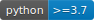

.. itea documentation master file, created by
   sphinx-quickstart on Sat May 29 20:41:09 2021.
   You can adapt this file completely to your liking, but it should at least
   contain the root `toctree` directive.

Welcome to itea's documentation!
================================

.. image:: assets/images/coverage.svg

.. image:: https://badge.fury.io/py/itea.svg
    :target: https://badge.fury.io/py/itea
|

itea is a python implementation of the Interaction-Transformation Evolutionary
Algorithm described in the paper "Franca, F., & Aldeia, G. (2020).
Interaction-Transformation Evolutionary Algorithm for Symbolic Regression.
Evolutionary Computation, 1-25."

The Interaction-Transformation (IT) representation is a step towards obtaining
simpler and more interpretable results, searching in the mathematical
equations space by means of an evolutionary strategy.

Together with ITEA for Classification and Regression, we provide a
model-specific explainer based on the Partial Effects to help users get a
better understanding of the resulting expressions.

This implementation is based on scikit-learn package and the implementations
of the estimators follows their guidelines.

.. toctree::
   :caption: Getting started:
   :maxdepth: 2
   
   gettingstarted

.. toctree::
   :caption: ITEA package documentation:
   :maxdepth: 3

   base
   itea.regression
   itea.classification
   itea.inspection

.. toctree::
   :caption: Example notebooks:
   :titlesonly:
   :glob:

   _*

Indices and tables
==================

* :ref:`genindex`
* :ref:`search`
